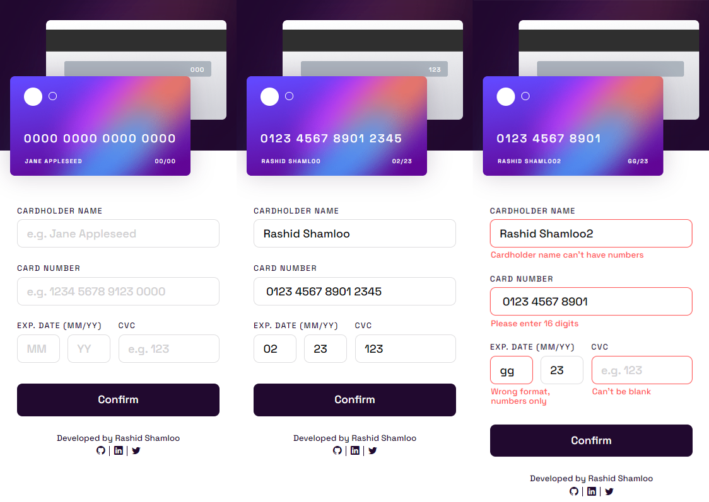
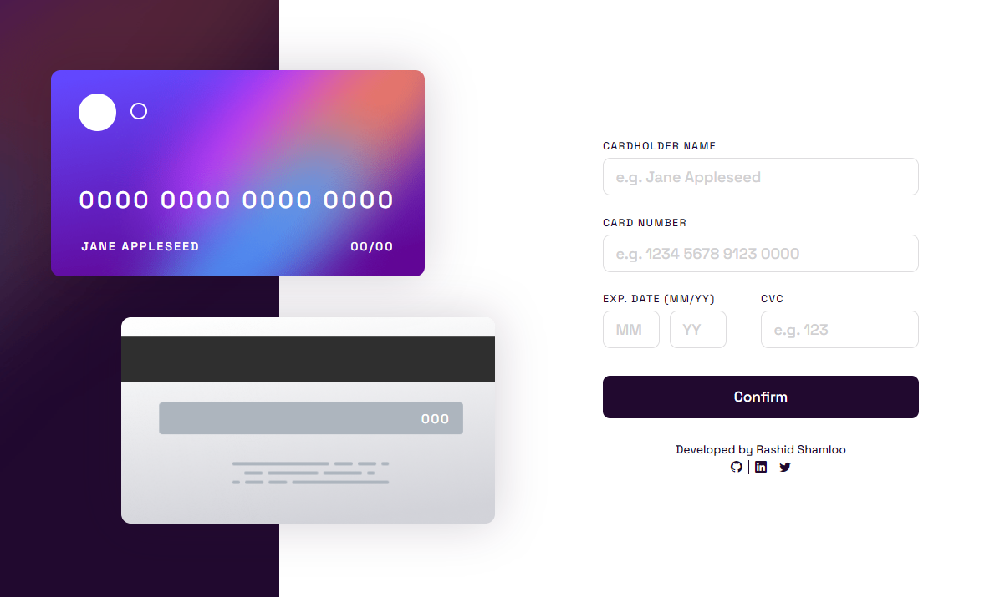

# Front End Mentor - Project 022 - Interactive Card Details Form

This is a solution to the [Interactive Card Details Form challenge on Frontend Mentor](https://www.frontendmentor.io/challenges/interactive-card-details-form-XpS8cKZDWw).

## Table of contents

- [Overview](#overview)
  - [Screenshot](#screenshot)
  - [Links](#links)
- [My process](#my-process)
  - [Built with](#built-with)
  - [What I learned](#what-i-learned)
  - [Useful resources](#useful-resources)
- [Author](#author)

## Overview

### Screenshot

- Mobile

- Desktop

### Links

- Solution URL: https://github.com/rashidshamloo/fem_022_interactive-card-details-form/
- Live Site URL: https://rashidshamloo.github.io/fem_022_interactive-card-details-form/

## My process

### Built with

- Semantic HTML5 markup
- Sass
- CSS Flexbox
- Vanilla Javascript

### What I learned

- Implementing preview elements and updating their values in real-time with JavaScript
- Validating input fields based on multiple conditions
- Formatting text with JavaScript
- Implementing grouped "label + input" elements
- Different properties of input fields

### Useful resources

- [Modern Normalize](https://github.com/sindresorhus/modern-normalize) - The CSS reset/normalize i used in this project

## Author

- Frontend Mentor - [@rashidshamloo](https://www.frontendmentor.io/profile/rashidshamloo)
- Twitter - [@rashidshamloo](https://www.twitter.com/rashidshamloo)
